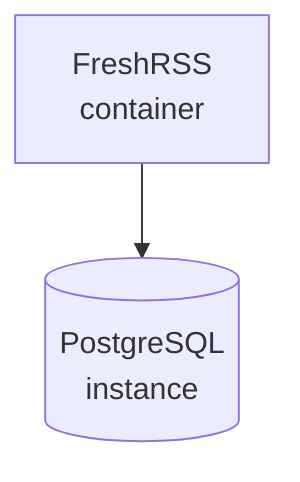

# Architecture

The deployment runs two core services on a shared Docker network:

- **FreshRSS** handles the HTTP interface and periodic feed updates. Persistent data and user-installed extensions are mounted from host volumes.
- **PostgreSQL** provides durable storage. Connection parameters are injected through the `.env` file.

Each service attaches to the `webgrip` bridge network and persists data via dedicated Docker volumes, allowing containers to be recreated without data loss.
